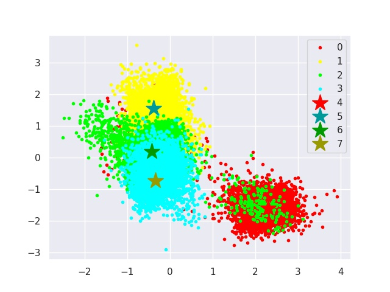
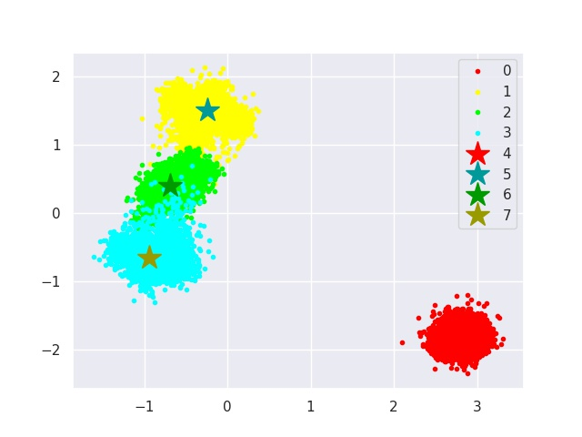
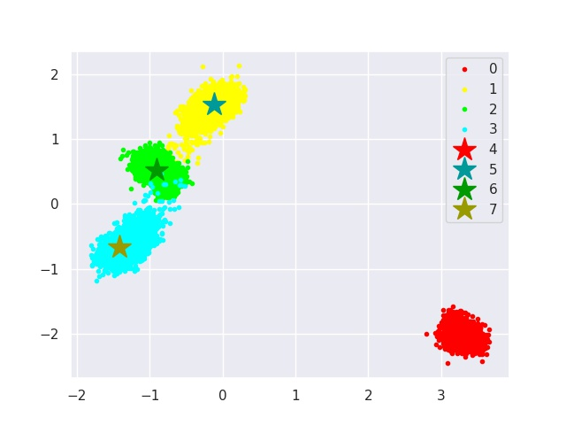
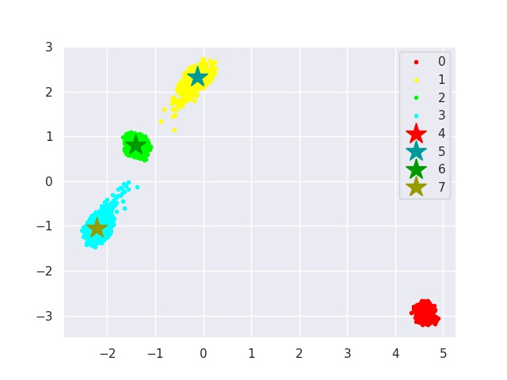
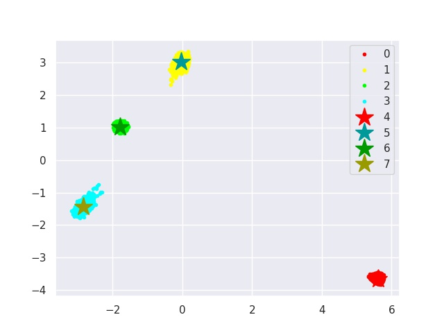
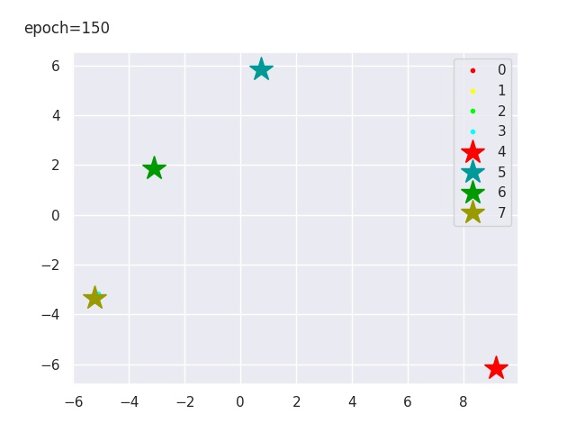
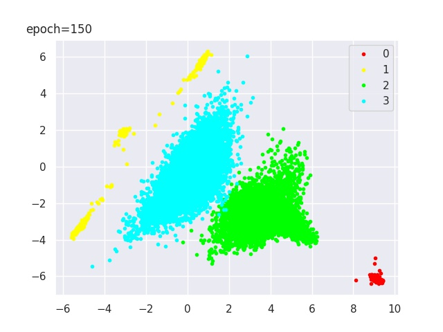

# Super-One-Class Classification

The resposity contains the demo and test code / pre-trained models (anonymous), and training code structure during the review stage. We will release the complete train code on more datasets (as well as tutorials and more pre-trained models) upon the acceptance. 

## 1. Testing Command Line

Using the following command line to get the example AUROC results: 
```sh
python main_ssl.py test --normal_class 0 --test_model_path model_fortest/class_0_fmnist.pth
```
In this example, the model are only trained with class 0 as the in-distribution data in the training set of FashionMNIST. The test phase is conducted on the test set of FashionMNIST, where class 0 as the in-distribution data and the rest classes are anomalies. 

With our provided pre-trained model, the **AUROC** should be **1.0**. 

## 2. Training Command Line

Using the following command line to run the training:

```sh
python main_ssl.py train --num_class 0 
```
Note that the config dictionary can be found in [main_ssl.py](./main_ssl.py). During review period, we only provide the training sturcture, some modules are missing. Upon acceptance, we would provide complete code with detailed tutorials. 

## 3. Pre-trained Model 

See the folder [model_fortest](./model_fortest).  

## 4. Visualization of the Training Process and a Testing Example

(1) Below shows the visualization of some trainning epoches. The reds are in-distributions (i.e., anchor class), and others colors represent augmented types. The dots and stars represent samples and centers, respectively. (note that the colorization here is different from manuscript) 


Epoch 1            |  Epoch 5 | Epoch 10 
:-------------------------:|:-------------------------:|:-------------------------:
 |   |  

Epoch 30            |  Epoch 50 | Epoch 150
:-------------------------:|:-------------------------:|:-------------------------:
 |   |  

(2) Below shows the visualization of the testing. The reds are in-distributions. The yellows are the augmented samples of the in-distributions. The greens are the anomalies (i.e., class 1-9 in FashionMNIST). The blues are the out-of-distribution data (test set of CIFAR10). 




In this example (as shown in the figure), the **AUROCs** of both semantic anomaly detection (class 0 vs. class 1-9 in FashionMNIST) and OOD detection (class 0 of FashionMNIST vs. CIFAR10) are **1.0**. 


